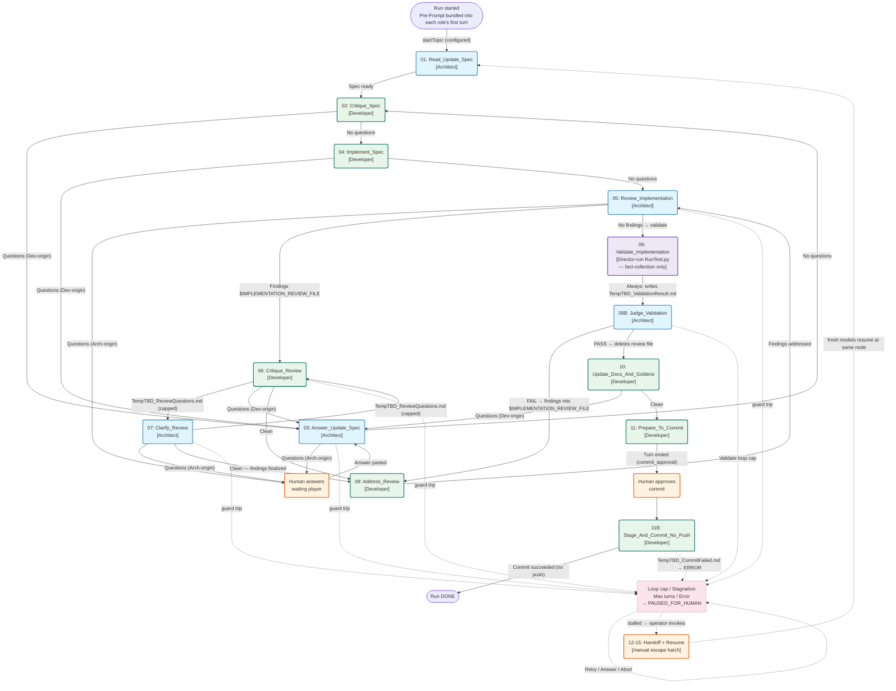

# SPISim™ LLMDirector Usage Manual

*Please see [TRADEMARK.md](./TRADEMARK.md) regarding trademark info.*

**[View LLM Lifecycle Flow](./LLMConductor.pdf)**

*This tool is to execute this flow autonomously.*

LLMDirector is an autonomous orchestrator that drives **LLMConductor** through the
full LLM-assisted feature-development lifecycle — ping-ponging between an Architect
and a Developer LLM with minimal human intervention.

It is a **Python web app** (`web/`) — a Flask dashboard on port 8081, reachable from
any browser on the intranet (phone, laptop, etc.) — that drives the Python
LLMConductor **in-process** via the `conductor_core` library (no network calls; the
Conductor web app does not need to be running).

---


---

## 1. Prerequisites

Before launching LLMDirector, the following must already be in place:

| Requirement | Details |
|---|---|
| `conductor_core` importable | The Director drives the Conductor **in-process** via the `conductor_core` library, reached through the `LLMDirector/LLMConductor` symlink. A *running* Conductor web app on port 8080 is **not** required — it is optional and only useful as a manual tmux viewer. |
| tmux sessions live | One session per target per project: `<TARGET>_<PROJECT>` (e.g. `CLAUDE_APP`, `CODEX_APP`). The Director never creates sessions. |
| Task documents written | The files named by `Key Files.FSD_FILE` and `Key Files.REVIEW_FILE` in `LLMConductor.json` (defaults: `Task_FSD.md` and `Task_CodeReview.md`) must exist in the project working folder. These are co-authored by the human and the Architect before the Director is launched; that phase is manual. |
| Hook helper | `~/batch/LLMHookEvent.sh` — a turn-completion emitter the Director deploys/updates automatically at run start (the configured `eventDir` is injected into it). See *Turn-completion delivery* in §4. |

---

## 2. Configuration (`LLMDirector.json`)

```json
{
  "conductorJsonPath": "LLMConductor/LLMConductor.json",
  "directorFlowJsonPath": "LLMDirector_Flow.json",
  "eventDir": "~/.llmdirector/events",
  "logDir":   "~/.llmdirector/logs",
  "dispatchEventPrompt": { "initialWaitSec": 10 },
  "limits": { "maxTurns": 40, "loopCap": 5, "turnTimeoutSec": 1200, "validationTimeoutSec": 1200, "tailPollSec": 5 },
  "notifyScript": "~/batch/LLMNotify.bat",
  "Hook": "~/batch/LLMHookEvent.sh",
  "HumanNotifyScript": "~/batch/LLMWaiting.bat"
}
```

| Field | Purpose |
|---|---|
| `conductorJsonPath` | **Required.** Path to `LLMConductor.json` — resolved relative to the config file, not CWD. Used by `conductor_core` to load the task definitions. |
| `directorFlowJsonPath` | **Required.** Path to `LLMDirector_Flow.json` — resolved relative to the config file. Defines the autonomous routing graph, start/end topics, and escalation rules. |
| `eventDir` | Where per-project NDJSON event files land (written by `LLMHookEvent.sh`). |
| `logDir` | Where per-run decision logs and persisted run-state JSON are written. |
| `dispatchEventPrompt.initialWaitSec` | A conditional, Director-managed delay before sentinel-dependent transition evaluation (e.g. backIf, nextIf, escalateIf, or universal questions guard). Default `10`. |
| `limits.maxTurns` | Hard cap on total turns per run (default 40). Pre-prompt initialization turns are excluded. |
| `limits.loopCap` | Cap applied to every per-edge loop counter (default 5). |
| `limits.turnTimeoutSec` | Seconds to wait for a turn-end event before escalating (default 1200 = 20 min). Applies to all `*_AWAITING_EVENT` statuses. |
| `limits.validationTimeoutSec` | Seconds allowed for `xta/tst/RunTest.py` to complete during the `validate_report` action before it is recorded as "could not run" (default 1200 = 20 min). |
| `limits.tailPollSec` | Seconds between event-tailing poll cycles (default 5). |
| `notifyScript` | Script invoked **server-side by the Director** when a run needs human attention. Supports template variables: `$PROJ`, `$TOPIC`, `$TARG`, `$KIND`, `$STATUS`, `$CWD`. If no arguments are provided in the string, the 4 legacy arguments `(project, kind, status, cwd)` are appended automatically. |
| `Hook` | Turn-completion mechanism. The path the script is **deployed to and the LLM is told to run** (`… --prompt <TARGET> <EVENT> <DISPATCH_ID> <CANONICAL_CWD>`). Default `~/batch/LLMHookEvent.sh`. An unusable path hard-fails the run. See *Turn-completion delivery* in §4. |
| `HumanNotifyScript` | Script the **LLM** is asked to run when the hook command does not print `EVENT_SENT_OK`, at the end topic, and if it raises a `[HUMAN]` question on an escalatable topic. Additive to the server-side `notifyScript`. Default `~/batch/LLMWaiting.bat`. |

`~` (and `$ENV`) are expanded at startup; relative `Hook`/`HumanNotifyScript` paths resolve against the repo root.

---

## 3. Launching

```bash
./RunWeb.bat
```

Activates the `pyx` venv, starts Flask on **port 8081**, and serves the dashboard at `http://<host>:8081`. Open from any browser on the intranet.

At startup the Director validates `LLMDirector_Flow.json` against `LLMConductor.json`. If validation fails, a yellow error panel is shown on the dashboard and the **Start Run** button is disabled until the config is fixed and the Director is restarted. Validation errors include file, topic, field, and bad-value detail.

To kill:
```bash
lsof -ti :8081 | xargs kill
```

---

## 4. Starting a run

1. Open `http://<host>:8081` in a browser.
2. Click **New Run**.
3. Select **Project**, **Architect target**, and **Developer target** from the dropdowns (populated from `LLMConductor.json` via the Director's `/api/conductor-config` endpoint — works even when the Conductor is down).
4. (Optional) Select a **Start Topic**. This dropdown is populated from the flow config's curated `entryTopics` list and defaults to the configured `startTopic` (`s0`). Picking a later entry point lets the run **skip ahead** — it begins at the chosen topic and still runs through to the configured `endTopic` (`e0`). Selecting anything other than `s0` shows an inline warning, because starting mid-pipeline assumes the prior phases' artifacts (implemented code, validation state, `TempTBD_*` files) already exist in the working folder — the Director cannot verify this. See *Per-run start topic* below.
5. The **Start Run** button enables once Project, Architect, and Developer have selections.
6. Click **Start Run**. The Director runs preflight (verifies tmux sessions, checks task documents, and sets up turn-completion delivery per the `Hook` mode — see below). It then dispatches from the selected start topic (default `startTopic`). The Conductor `Default["Pre-Prompt"]` (collaboration policy) is **bundled into each role's first workflow turn** — prepended to that turn's prompt — so it is sent once per role without a separate acknowledgement turn.

**Preflight rejects:**
- Either tmux session not found.
- The two players resolve to different working directories.
- `Task_FSD.md` or `Task_CodeReview.md` missing in that folder.
- The same working folder already has an active run.

**Turn-completion delivery:** how the Director learns a target finished its turn (it tails `eventDir/<cwd>.ndjson` for a `Stop`/`AfterAgent` line). The single emitter `LLMHookEvent.sh` is deployed at preflight with the configured `eventDir` injected; the `Hook` config selects the mode:

- **Hook script execution:** The Director deploys `LLMHookEvent.sh` to the configured `Hook` path and appends a sentence to every dispatched prompt telling the LLM to run it exactly once as its final action using the positional syntax: `<Hook path> --prompt <TARGET> <EVENT> <DISPATCH_ID> <CANONICAL_CWD>`. The script performs exact verification and idempotent duplicate handling based on the dispatch id. If the command does not print `EVENT_SENT_OK`, the prompt tells the LLM to run `HumanNotifyScript` and stop. No agent settings are touched.

### Per-run start topic (skip-ahead)

Every run still terminates at the same single human-gated commit point (`endTopic` /
`e0`, normally `11B: Stage_And_Commit_No_Push`, gated by the `11: Prepare_To_Commit`
approval step); the **only** thing the Start Topic selector
changes is **where the run begins**. This makes it a "resume / skip-ahead" control,
not a windowing control — there is no per-run *end* topic.

- The menu is the flow config's **`entryTopics`** list (see §14), presented in the
  order the config author declared it, with `startTopic` always first. When
  `entryTopics` is absent the selector offers only `startTopic`, so behavior is
  unchanged from before this feature existed.
- The Director validates at config load that every `entryTopics` entry exists and
  that `endTopic` is still reachable from it; an invalid entry blocks runs via the
  same error panel as any other flow-config error.
- A run that starts at a later entry point may still traverse *earlier* topics at
  runtime via normal back-edges and the universal `questionsBackTo` route (e.g. a
  question raised at `04` routes to `03`). The start topic only sets the **entry
  point**; it does not fence the run into a sub-range. While the run is below its
  start topic the dashboard topic bar shows "off-path (retrying)".
- **Persisted-state interaction:** if a `*.state.json` already exists for the target
  working folder, a *live* (non-terminal) run is resumed at its saved node and the
  Start Topic choice is **ignored**; only a *terminal* (`DONE` / `ABORTED` / `ERROR`)
  saved state yields to a fresh run from the chosen start topic. This prevents the
  selector from silently discarding an interrupted run's progress.

### Concurrent runs (multiple projects at once)

You can drive several projects **in parallel** from one Director. While a run is in
progress, click **New Run** again, pick a different project (with its own Architect /
Developer targets), and **Start Run** — both appear on the dashboard and advance
independently. There is no single-run limit.

- Each project has its own working folder and its own tmux sessions
  (`<TARGET>_<PROJECT>`, e.g. `CLAUDE_APP` vs `CLAUDE_OTH`), so two runs never collide
  even when they share the same Architect/Developer *target* — they drive separate panes.
- All concurrent runs **share** the one Conductor DRIVEN lock; it is released only when
  the **last** run reaches a terminal state (see §9).
- The **validation step is serialized globally** (`_validation_lock`, §11): if two runs
  reach `09: Validate_Implementation` at the same moment, one waits for the other's test
  suite to finish. Everything else (dispatch, review loops, escalations) runs truly
  concurrently.

The **only** restriction: you cannot start a second run in the **same working folder** —
preflight rejects it ("the same working folder already has an active run"). Distinct
projects normally map to distinct folders, so this only bites if two project entries
point at the same directory.

---

## 5. Run dashboard

Each run card shows:

| Field | Meaning |
|---|---|
| Project | Project name (e.g. `OTH`). |
| Arch / Dev | Which LLM target fills each role. |
| State | Current flow topic, driven by `LLMDirector_Flow.json` from configured `startTopic`. |
| Status badge | See status enum below. |
| Topic progress bar | Position in the shortest path from the run's **start topic** (the selected entry point, default `startTopic`) to `endTopic`. Shows "off-path (retrying)" when in a retry loop — or below the start topic — not on that shortest path. |
| Turns progress bar | `total_turns / limits.maxTurns`. |
| Loop progress bar | Active loop counter value / `loopCap`, labelled by the `loopCounter` name configured for the current topic (e.g. `Validate 1 / 5`, `CritiqueReview 2 / 5`). Omitted when outside a counted loop. |
| Elapsed / Started | Time since run creation and the `YYYY-MMDD-HHMMSS` start timestamp. |
| Decision log | Scrollable log of every routing decision, timestamp, and escalation. |

**Status display labels:**

| Stored enum | Displayed as |
|---|---|
| `RUNNING` | RUNNING |
| `DISPATCHED_AWAITING_EVENT` | AWAITING TURN END |
| `HUMAN_ANSWER_SENT_AWAITING_EVENT` | AWAITING TURN END |
| `PAUSED_BY_USER` | PAUSED |
| `IN TRANSITION TO ...` | IN TRANSITION TO ... |
| `PAUSED_FOR_HUMAN` | PAUSED FOR HUMAN |
| `DONE` | DONE |
| `ABORTED` | ABORTED |
| `ERROR` | ERROR |

The dashboard auto-refreshes every 5 seconds in the web UI.

---

## 6. Run controls

| Control | What it does |
|---|---|
| **Pause** | Stops further dispatch; keeps tailing the event file. |
| **Resume** | Re-enters awaiting-event tail or dispatches the next topic. |
| **Abort** | Tears down the run. Releases the Conductor DRIVEN lock if this was the last active run. |
| **Answer** | Opens the escalation panel (see §7). |
| **Arch / Dev Screen** | Captures the player's current tmux pane (read-only). |
| **Show Log** | Opens the per-run decision log file. |

---

## 7. Human escalation

When a run enters `PAUSED_FOR_HUMAN`, the `notifyScript` fires and the dashboard highlights the run. The `escalation_kind` field identifies the cause:

| Kind | Trigger |
|---|---|
| `QUESTION` | Agent produced the configured questions sentinel (default `TempTBD_Questions.md`) and the topic is configured to escalate rather than auto-route. |
| `LOOP_CAP` | A per-edge loop counter reached `loopCap`. |
| `STAGNATION` | Two consecutive iterations produced identical sentinel-file content. |
| `MAX_TURNS` | Total turn count reached `maxTurns`. |
| `ERROR` | Validation output unparseable or dispatch failed. |
| `COMMIT_APPROVAL` | `11: Prepare_To_Commit` reached — human approval required before the run stages and commits (no push). Approve via the run's **Resume** ("Approve Commit") control to advance to `11B: Stage_And_Commit_No_Push`. |

**Which control to use depends on the kind** (the status badge reads `PAUSED FOR HUMAN` for all of them, so go by `escalation_kind` / the current node):

| Kind | What you click |
|---|---|
| `QUESTION` | **Answer** — opens the escalation panel showing the configured questions sentinel file (default `TempTBD_Questions.md`). Review it and the tmux screen capture, type a response, and click **Send Answer**. The Director composes a resumed prompt combining the original topic instructions (from `LLMConductor.json`) with the human answer, then dispatches it to the current role's target. |
| `COMMIT_APPROVAL` | **Approve Commit** (the run's Resume control, relabeled at this node) — transitions the run to DONE and releases the Conductor lock. There is no Answer panel here. |
| `LOOP_CAP` / `MAX_TURNS` | **Resume** — clears the relevant loop/turn counters and re-dispatches the current topic. (Fix the underlying stall first if needed — see §8.) |
| `STAGNATION` / `ERROR` | **Resume** — clears stagnation state and re-dispatches the current topic once you've addressed the cause. |

---

## 8. Handoff / model swap (stalled loop escape hatch)

If a loop is cycling without converging, swap in fresh LLM models. This is the one
operator procedure that uses the **optional Conductor web app** — start it (port 8080)
for the manual dispatches below:

1. Dispatch **`12: Handoff_Architect`** and **`13: Handoff_Developer`** via the Conductor's MANUAL UI. Each model writes a neutral state dump to `TempTBD_ResumeA.md` / `TempTBD_ResumeB.md`.
2. Change the Architect and Developer dropdowns to fresh targets.
3. Dispatch **`14: Resume_Architect`** and **`15: Resume_Developer`**. Each fresh model reads both files and forms an independent judgment. Whichever runs second finds the counterpart's read-marker and deletes both files.
4. The run resumes from the same FSM node.

---

## 9. Conductor lock

The Director holds the Conductor's **DRIVEN lock** — a local file at
`~/.llmconductor/driven.lock` (controller `LLMDirector`), shared with any Conductor
process on the same host — for the lifetime of all active runs:

- Lock **acquired** on the first run started.
- All concurrent runs **share** the one lock token.
- Lock **released** only when the last run reaches a terminal state (DONE / ABORTED / ERROR).
- On Director shutdown, run state is preserved for resume.
- On a crash, the lock is left held. A Director **restart re-adopts its own lock automatically** (reclaim-by-controller, FSD D-3) — no manual break-glass needed. To hand control to a human instead, clear the lock by deleting `~/.llmconductor/driven.lock` (or, if the optional Conductor web app is running, its break-glass **"Take control"** button).

---

## 10. Persistence and restart

Run state is written to `<logDir>/<sanitized-cwd>.state.json` after every state change.
The selected entry point is persisted as `start_node` (older state files without it are
backfilled to the global `startTopic`, since legacy runs always began there). On restart:

- The Director resumes tailing from the persisted watermark.
- **`DISPATCHED_AWAITING_EVENT`** — tails for the turn-end event; does not re-dispatch.
- **`HUMAN_ANSWER_SENT_AWAITING_EVENT`** — tails for the turn-end event; does not re-paste.
- **`PAUSED_*`** — waits for operator action.

---

## 11. Validation run

The Director runs the driven **project's own** `./xta/tst/RunTest.py` (not the Director's self-test) from the project's `cwd`, but **only as fact-collection, never as judgement** — this is the `validate_report` action at `09: Validate_Implementation`. Running RunTest.py is collecting a fact; *interpreting* the result is a judgement, and the Director does neither the interpreting nor the routing-on-result. It writes the raw outcome (exit code, parsed `FAIL : <n>` count, and the tail of stdout) to `TempTBD_ValidationResult.md` and then **always** advances to `09B: Judge_Validation`, where the **Architect** reads the report and decides. A non-zero exit or unparseable `FAIL` line is recorded (count `n/a`), not escalated — the Architect judges it. Validation is serialized globally across concurrent runs by default (`_validation_lock`).

The suite is scoped by the FSD: if the FSD carries a `TEST_ROSTER=` marker the Director runs `RunTest.py --file <roster>`; otherwise it runs the full `RunTest.py -a`. If the FSD declares no suite (`NO_TEST_SUITE` marker) the run is recorded as a skip (PASS, no tests). The Director only escalates `ERROR` here for genuine config blockers it cannot collect a fact about: `xta/tst/RunTest.py` missing, or a declared roster file that does not exist.

The Architect's judgement at `09B`: on **pass** it deletes `$IMPLEMENTATION_REVIEW_FILE` and the run proceeds to `10: Update_Docs_And_Goldens`; on **fail** it writes the failures as findings into `$IMPLEMENTATION_REVIEW_FILE`, routing the run back to `08: Address_Review` for the Developer to fix (the `Validate` loop counter guards this against cycling forever).

---

## 12. Self-test

```bash
python3 xta/tst/RunTest.py -a
```

Runs the Python unit tests. All must pass for `SUCCESS : 1`. Coverage includes:
- Flow config validation (valid/invalid fixtures under `xta/tst/dat`)
- Timestamp format (`YYYY-MMDD-HHMMSS`)
- Config-driven FSM transitions (all 10 workflow topics)
- Resume dispatch behavior for all escalation kinds
- Commit approval → DONE path
- Abort persistence (ABORTED state, lock release)
- Turn timeout (all `*_AWAITING_EVENT` statuses)
- Conductor lock lifecycle (single/concurrent runs)
- Human-answer dispatch (composed prompt, sentinel-config-driven label)
- Pre-prompt initialization (per-role, no `total_turns` increment)
- Persistence and backward compatibility (old state files backfilled)
- Test progress computation (`questionsSentinel` exposure, loop counter display)
- Config error surfacing (HTTP 200 on error, run creation blocked)
- Per-run start topic selection (`entryTopics` validation, curated menu order,
  `start_node` persistence/backfill, progress computed from the run's start topic,
  resume-vs-fresh handling when a persisted state exists)
- Branding: logo route, favicon link, header logo image
- Hook config resolution (relative path expansion)
- Director-managed script generation (stale check, existence, permissions)
- Dispatch augmentation (bundled-pre-prompt first turn, topic, human-answer turns; hook gating)
- Hook validation (startup check, new-run hard-fail, side-effect free)
- Transition delay (pause/resume/restart, sentinel triggers)
- Event script robustness (JSON escaping, strict arguments, exact verification)


---

## 13. Port map

| Component | Port |
|---|---|
| LLMConductor Python web (optional — manual viewer only; not required for runs) | 8080 |
| LLMDirector web (Flask) | 8081 |

---

## 14. The FSM — lifecycle flow

The Director's core logic is a Finite State Machine (FSM) that orchestrates the
handoff between roles. 

**Config-Driven Routing (`LLMDirector_Flow.json`):**
The Director's transition logic is driven by the companion flow config `LLMDirector_Flow.json`
(path set via `directorFlowJsonPath` in `LLMDirector.json`). The flow config declares:
- `startTopic` and `endTopic`: default first and last workflow topics
- `entryTopics` (optional): curated list of topic IDs offered in the dashboard's
  **Start Topic** selector so a run can skip ahead to a later entry point while still
  running through to `endTopic` (see §4 *Per-run start topic*). Each entry must exist
  in `LLMConductor.json` and must be able to reach `endTopic`; `startTopic` is always
  a valid entry point and is listed first. When omitted, only `startTopic` is offered.
- Per-topic routing: `backIf`/`backTo`, `nextIf`/`nextIfTo`, `escalateIf`/`escalateKind`,
  `nextTo` (unconditional default), and `action` (`validate_report`, `validate`, or `commit_approval`)
- `questionsBackTo` / `questionsEscalateTopics` / `questionsSentinel`: universal questions-sentinel routing. `questionsSentinel` names the sentinel file (should be declared explicitly whenever `questionsBackTo` or `questionsEscalateTopics` is used). File name values in the flow config may use `$KEY` placeholders matching entries in `LLMConductor.json` `Key Files` — they are expanded at startup using the same rules as LLMConductor (longest-key-first, one pass).
- `loopCounter` / `incrementLoopCounter`: loop counter name and which edge increments it

The Director validates this config at startup: all topic IDs must exist in `LLMConductor.json`,
all `*To` destinations must be reachable, sentinel paths must be safe relative paths,
sentinel filenames must appear in the topic's `Mesg` text, and every `entryTopics` entry
must exist and be able to reach `endTopic`. If validation fails, the dashboard
shows an error panel and run creation is blocked.

**One-Time Role Pre-Prompt:**
On each role's (Architect or Developer) first workflow turn, the Director **bundles**
`Default["Pre-Prompt"]` from `LLMConductor.json` into that turn — prepended to the topic
prompt — and marks the role initialized. It is therefore sent exactly once per role with no
separate acknowledgement turn. (Earlier versions sent it as its own
`PRE_PROMPT_SENT_AWAITING_EVENT` turn; that was removed because a contentless policy turn
relied on the agent independently firing a turn-end event, which stalled with some agents.)

**Turn Timeout:**
When a run is in any `*_AWAITING_EVENT` status and no hook event arrives within
`limits.turnTimeoutSec`, the run escalates with `TURN_TIMEOUT`. The decision log records the
elapsed wait. Human operator resumes via the **Resume** button.

**Transition Delay (`IN TRANSITION TO ...`):**
To ensure all file writes and deletions from the previous turn are fully settled and
flushed to disk before the Director evaluates the next flow branch, a deterministic
delay (`initialWaitSec`, default 10s) is applied whenever the transition depends on
filesystem sentinels.
- **Triggers:** Delay is triggered if the current topic declares `backIf`, `nextIf`,
  or `escalateIf`, OR if the universal `questionsBackTo` / `questionsEscalateTopics`
  guards are active and the topic does not otherwise declare those sentinels.
- **Behavior:** Upon receiving the completion event, the run enters
  `IN TRANSITION TO ...` status.
  The Director waits until `initialWaitSec` has elapsed since the event was matched
  before evaluating the transition.
- **Lifecycle:**
    - **Pause:** Pausing a transition preserves the original absolute due time; delay
      continues to elapse while the run is paused.
    - **Resume:** Resuming an overdue transition triggers immediate evaluation; otherwise
      it restores the waiting state.
    - **Restart:** Director restart restores the original `transition_due_at` and
      waits the remaining time.
    - **Abort:** Aborting a transition cleans up the run state normally.
- **Timeout:** `TURN_TIMEOUT` is **excluded** while in transition; once the event
  is matched, the turn is considered complete.

**DRIVEN Dispatch Semantics:**
When the Director is driving a run, it uses the "DRIVEN" dispatch mode which optimizes
for autonomous predictability:
- **Immediate Execution:** Messages are pasted into tmux and followed immediately
  by an `Enter` keypress.
- **Clean Prompts:** Default `Pre-Prompt`, `Post-Prompt`, and `Pre-Script` settings from
  `LLMConductor.json` are **skipped** for all normal workflow topic dispatches. This ensures
  the agent receives only the direct task instructions without human-centric collaboration
  boilerplate. (The only exception is `Default["Pre-Prompt"]`, which is bundled into each
  role's first workflow turn once per role.)
- **Fail-Safe Escalation:** Any dispatch failure (e.g. missing tmux session) is caught
  and routed to `PAUSED_FOR_HUMAN` rather than crashing the Director.

**Supported `action` values:**
- `validate_report` (current gate, `09: Validate_Implementation`): Runs the project's
  `xta/tst/RunTest.py` as **fact-collection only**. Honors the FSD test scope
  (`--file <roster>` if a `TEST_ROSTER=` marker is present, full `-a` otherwise; skipped
  on a `NO_TEST_SUITE` marker), writes the outcome to `resultFile`
  (`TempTBD_ValidationResult.md`), and **always** routes to `nextTo`
  (`09B: Judge_Validation`) — it never decides pass/fail and never escalates on a test
  failure. Only genuine config blockers (RunTest.py missing, or a declared roster file
  absent) escalate `ERROR`. Serialized globally by `_validation_lock`. The Architect at
  `09B` reads the report and routes: pass → `10`, fail → findings into
  `$IMPLEMENTATION_REVIEW_FILE` → back to `08: Address_Review`.
- `validate` (legacy self-judging gate, retained for older flow configs): Runs
  `xta/tst/RunTest.py -a` and routes itself — `passTo` on `FAIL : 0`, `failTo` on
  `FAIL : n > 0`, `ERROR` on missing/unparseable output. The current flow no longer uses
  this action; `validate_report` replaced it precisely so the Director stops judging.
- `commit_approval` (`11: Prepare_To_Commit`): Pauses with
  `escalation_kind = COMMIT_APPROVAL`. Human approves via the **Approve Commit** button,
  which advances the run to `11B: Stage_And_Commit_No_Push` (stage + commit, no push).



---

## 15. Dry run

The dry run lets you exercise the Director's full FSM — including loops, human escalation, and validation — without real LLM sessions. A bash script (`dryrun_agent.sh`) replaces each LLM in a tmux session, detecting the dispatched topic by grepping the pasted prompt and executing a scripted scenario. The sandbox uses the **real** `LLMDirector_Flow.json` and `LLMConductor.json` (so the scenario tracks the live flow) plus a stub `RunTest.py` that always passes.

**Hardcoded scenario (new review-before-validate flow):**
1. **Spec phase** — `01: Read_Update_Spec` confirms the spec, then 2 loops: `02: Critique_Spec` raises `TempTBD_Questions.md` twice; `03: Answer_Update_Spec` clears it each time; 3rd `Critique_Spec` is clean → `04: Implement_Spec`.
2. **Implementation** — `04: Implement_Spec` produces a clean implementation → straight to `05: Review_Implementation` (no validation yet).
3. **Review phase** — `05: Review_Implementation` raises findings (`TempTBD_Review.md`); 3 `06: Critique_Review` ↔ `07: Clarify_Review` loops via `TempTBD_ReviewQuestions.md`. On the 3rd loop, `Clarify_Review` raises `TempTBD_Questions.md` → **human escalation**.
4. **Human answers** → `07: Clarify_Review` cleans everything → `08: Address_Review` → `05: Review_Implementation` pass 2 (no findings).
5. **Validation (Director-run)** — clean review routes to `09: Validate_Implementation`, where the **Director itself** runs the stub `RunTest.py` (no agent turn) and writes `TempTBD_ValidationResult.md`, then dispatches `09B: Judge_Validation` to the Architect. The first judge round simulates a **test failure** → findings into `TempTBD_Review.md` → back to `08: Address_Review` → `05` (clean) → re-validate → `09B` passes.
6. **Finalization** — `10: Update_Docs_And_Goldens` → `11: Prepare_To_Commit` (Director escalates `COMMIT_APPROVAL`); human approves → `11B: Stage_And_Commit_No_Push` → DONE.

### Quick start

```bash
# 1. Setup the hermetic dry-run sandbox
./xta/bin/dryrun_setup.py

# 2. Start the isolated LLMDirector (using the sandbox config)
#    Copy-paste the exact command printed by the setup script, e.g.:
python3 web/app.py --config /tmp/llmd_dryrun/LLMDirector.json

# 3. Open http://localhost:58082 → New Run
#    Select these exact values:
#    Project:   DRYRUN
#    Architect: ARCH_LLM
#    Developer: DEV_LLM
#    Click 'Start Run'
```

### What to observe

| When | What you see |
|---|---|
| Run starts | Director dispatches `01: Read_Update_Spec` with `Default["Pre-Prompt"]` bundled into the Architect's first turn, then `02: Critique_Spec`; status becomes `AWAITING TURN END`. |
| After ~3 s | `TempTBD_Questions.md` appears; Director routes to `03: Answer_Update_Spec` |
| After 2 spec loops | Director advances to `04: Implement_Spec` → `05: Review_Implementation` |
| Review loops | Dashboard cycles through `05→06→07→06→07…` (`CritiqueReview` counter incrementing) |
| 3rd Clarify loop | Run pauses at `07: Clarify_Review` as PAUSED FOR HUMAN (kind `QUESTION`); notification fires. **Click Answer**, type anything, **Send Answer** → run resumes. |
| Validate (Director-run) | After review is clean, `09: Validate_Implementation` runs the stub RunTest.py (no agent turn) and writes `TempTBD_ValidationResult.md`; `09B: Judge_Validation` follows. The first judge round fails → run loops back through `08: Address_Review` → `05` → re-validate; the second `09B` passes (`Validate` counter increments). |
| Completion | Run pauses at `11: Prepare_To_Commit` (kind `COMMIT_APPROVAL`). **Click Approve Commit** → `11B: Stage_And_Commit_No_Push` → run goes to DONE. |

> Both pauses show the same `PAUSED FOR HUMAN` badge — pick the control by the **node**: `07: Clarify_Review` → **Answer**; `11: Prepare_To_Commit` → **Approve Commit**. See §7 for the full kind→control mapping.

### Customising delays

Edit the `STEP_DELAY` variable at the top of `xta/bin/dryrun_agent.sh` (default 3 seconds).

### Teardown

```bash
# Stops the Director server (by port), kills the tmux sessions, and removes the sandbox
./xta/bin/dryrun_setup.py --teardown
```

This is the single command to fully tear the dry run down — you do **not** need to hunt for and kill processes by hand. It:
- stops the Director server bound to the dry-run port (`58082`),
- kills the `ARCH_LLM_DRYRUN` / `DEV_LLM_DRYRUN` tmux sessions, and
- removes the temporary sandbox folder (`/tmp/llmd_dryrun`).

---

## 16. Real-world test (live LLMs)

Where the dry run (§15) replaces each agent with a scripted bash responder, the
real-world test drives **actual LLM CLIs** (claude / codex / gemini) through the
full flow. It is the way to validate behaviour that a fake agent can't — that a
real agent actually runs the appended `LLMHookEvent.sh --prompt …` line to signal
turn-end, including on its bundled first (Pre-Prompt) turn.

To keep token cost negligible, the harness generates a sandbox `LLMConductor.json`
in which **every topic prompt is overridden with a 1–3 line instruction** that
just creates/deletes the right `TempTBD_*` sentinel file, so the Director's
routing branches are exercised without the agent doing real work. It also uses an
**isolated hook** (`/tmp/llmd_realtest/LLMHookEvent.sh`, so the operator's
`~/batch/LLMHookEvent.sh` is never touched) and `/bin/echo` as `HumanNotifyScript`
(no RGB/Pushover/Gotify during the test).

Unlike the dry run, the two tmux sessions are left **empty** — you attach and
launch the real LLM in each. The two human gates are operator-driven from the
dashboard.

**Scenario** (touches every node 02–11 once, plus one `QUESTION` escalation and
the commit gate):

  `02` raise question → `03` (escalates `QUESTION`; you answer, telling it to delete
  the question) → `02` clean → `04` → `05` (stub PASS) → `06` findings → `07`
  review-question → `08` clears it → `09` → `05` (PASS) → `06` clean → `10` →
  `11` (`COMMIT_APPROVAL`; you approve) → DONE.

Determinism comes from tiny flag files (`.rt_spec`, `.rt_review`) the prompts
check, so the loop branches are taken exactly once.

### Quick start

```bash
# 1. Build the sandbox + two EMPTY tmux sessions
./xta/bin/realworld_setup.py

# 2. Attach to each session and launch a real LLM (the sessions start in the project dir).
#    Launch it in a mode that runs bash WITHOUT a manual approval each turn, or the
#    appended LLMHookEvent.sh line won't fire and the run stalls.
tmux attach -t ARCH_RT_REALTEST   # launch the Architect LLM, then Ctrl-b d
tmux attach -t DEV_RT_REALTEST    # launch the Developer LLM, then Ctrl-b d

# 3. Start the isolated Director (copy the exact command the setup script prints):
cd <repo root> && python3 web/app.py --config /tmp/llmd_realtest/LLMDirector.json

# 4. Open http://localhost:58083 → New Run → select:
#    Project: REALTEST   Architect: ARCH_RT   Developer: DEV_RT  → Start Run
```

### Operator gates

| When | What to do |
|---|---|
| `QUESTION` at `03: Answer_Update_Spec` | Click **Answer**, type `Delete TempTBD_Questions.md then reply done`, **Send Answer**. The **Architect agent** must actually delete the file for the flow to advance. |
| `STAGNATION` (safety net) | If the agent ignores the delete instruction, the run pauses with `STAGNATION` and the run card **names the file to delete** (e.g. `delete to continue: TempTBD_Questions.md`). `rm` that file in `/tmp/llmd_realtest/project/`, then click **Resume**. |
| `COMMIT_APPROVAL` at `11: Prepare_To_Commit` | Click **Approve Commit** → run advances to `11B: Stage_And_Commit_No_Push` (stage + commit, no push). |

> If a turn never advances, the agent didn't run the appended `LLMHookEvent.sh
> --prompt <TARGET> <EVENT> <DISPATCH_ID> <CANONICAL_CWD>` line — check that the
> LLM is allowed to run bash without a per-command approval (see §4
> *Turn-completion delivery*).

### Teardown

```bash
# Stops the Director (by port 58083), kills the tmux sessions, removes the sandbox
./xta/bin/realworld_setup.py --teardown
```
id-run.
